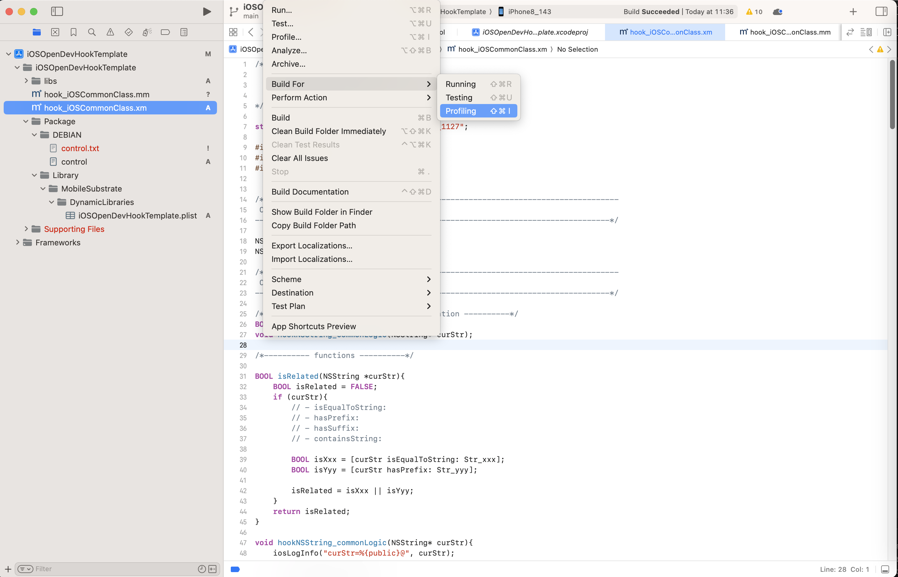
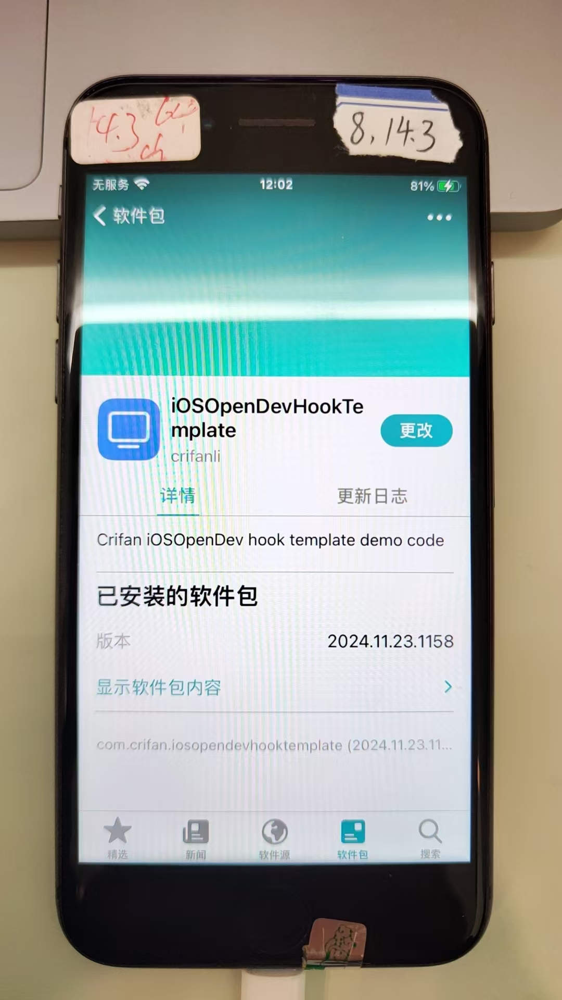
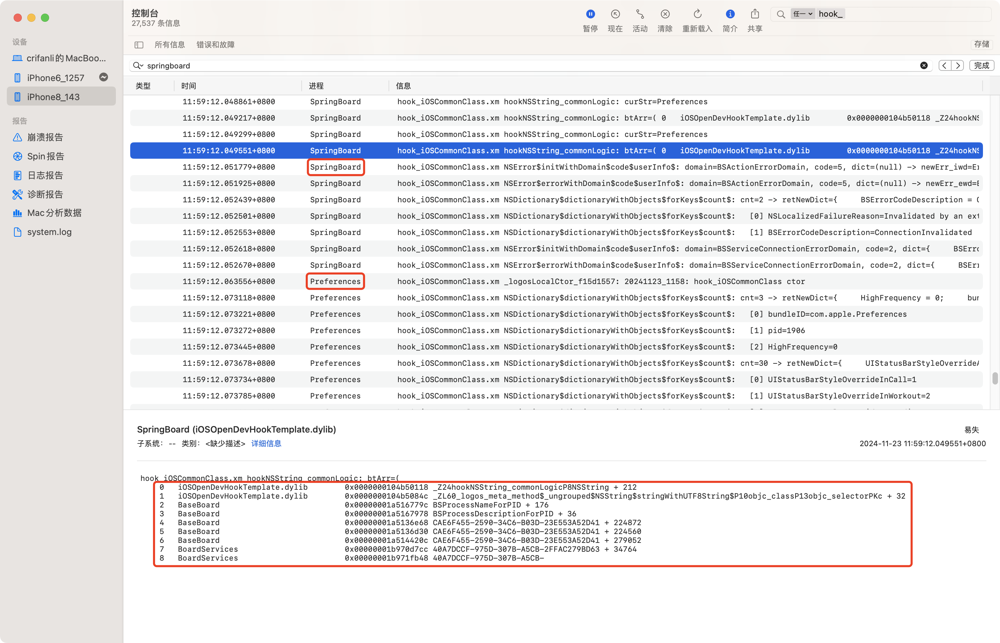

# iOSOpenDevHookTemplate

* Update: `20241123`

## Repo

https://github.com/crifan/iOSOpenDevHookTemplate.git

## Funcion

Use as a startup template of `Xcode`+[iOSOpenDev](https://book.crifan.org/books/ios_re_iosopendev_tweak/website/) to hook some iOS app/exectuable/dylib/...

## Usage

* Init
  * change `Xcode`->`Targets`->`Build Settings`->`User-Defined`->`iOSOpenDevDevice` to your iPhone WiFi IP
    * and make sure **ssh login without password**
      * [ssh免密登录 · iOS逆向开发：iOSOpenDev开发插件](https://book.crifan.org/books/ios_re_iosopendev_tweak/website/normal_tweak_process/ssh_no_pwd_login.html)
* Normal Development
  * Clean
    * `Xcode`->`Product`->`Clean Build Folder`
  * Build & Install
    * `Xcode`->`Product`->`Build For`->`Profiling`
      * will auto build and install compiled `tweak`=`plugin`=`iOSOpenDevHookTemplate.deb` into connected iPhone

## Effect

* Mac
  * Xcode Build
    * 
* iPhone8
  * Sileo installed tweak
    * 
* Mac
  * Console.app can see hook log -> tweak worked
    * 
